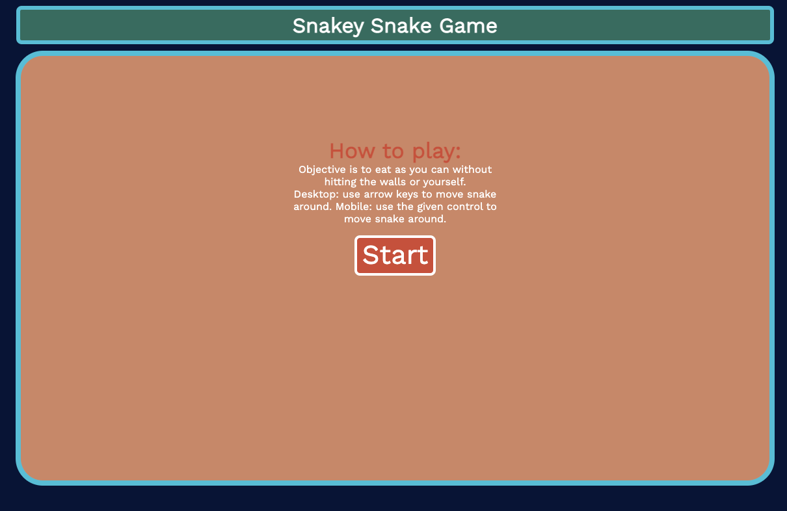

# Snakey Snake

## Date: 07/02/2022

### By: Khwa Oo

[LinkedIn](https://www.linkedin.com/in/khwa-oo/) | [Github](https://github.com/Khwalab3ar)

---

### _Game Link_

[Snakey Snake](https://snakeysnake.surge.sh/)

### _Description_

#### Simple snake game that allows the user to use the up, down, left, right arrow keys on desktop to move their snake around and collect dot. The snake will grow and move faster as the user collect more dots. Users are able to play on mobile using a touch control.

---

### _Technologies_

- HTML
- CSS
- JS

---

## _Trellio Board_

### [Trellio Board](https://trello.com/b/8jzwWJ5m/snakey-snake-game)

---

## _Screenshots_

### Desktop Home

### Desktop Game

### Mobile Home

### Mobile Game

---

## _Future Updates_

- [x] Compatible with mobile
- [ ] Smoother Transition
- [ ] Add leveling up alert
- [ ] Add different scenerios for higher level

---

## _Credits_

### [MDN](https://developer.mozilla.org/en-US/)

### [W3Schools](https://www.w3schools.com/default.asp)

### [Stack OverFlow](https://stackoverflow.com/)

---
